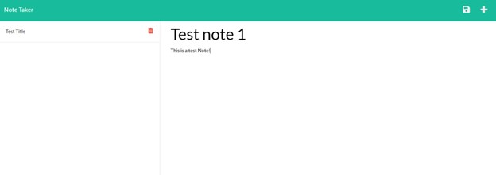

# Note-Taker-App---UNC---Zac-Ellis

## Table of contents
1.) [Description](#description)
2.) [Installation Instructions](#install)
3.) [Usage](#usage)
4.) [Contributers](#contributers)
5.) [Testing Instructions](#testing)
6.) [Contact Information](#contact)
7.) [Screen Shots and Link to demo](#screenShots)

## Description
Note taker application for keeping track of tasks.  

## Installation Instructions
Install with "npm install" in the terminal.

## Usage
Type notes into prompted fields and click the save icon to save notes. 
Delete notes using the trash can icon. 

## Contributers
Zac Ellis

## Testing Instructions 
Write new notes and delete old ones.  

## Contact Information
GitHub: zellis117 , Email: zacellis117@gmail.com

## Screen Shots

